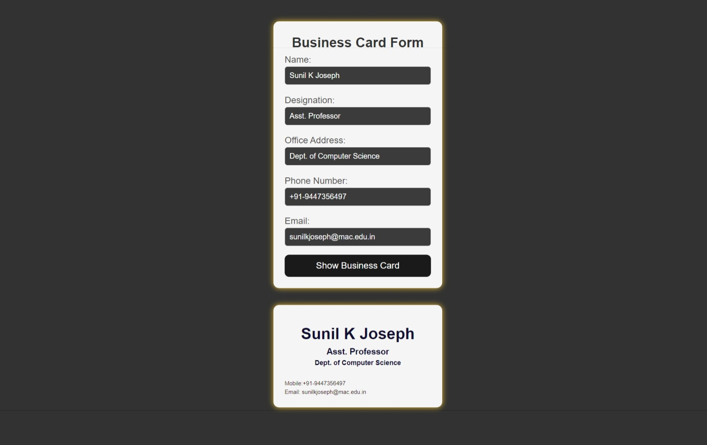

# React Namaste Part 2

This program is developed based on the second video released in the React video series by MuLearn, provided through their YouTube channel MuTech, as an introduction to React Application Development.

## Business Card Generator App

This React application allows users to input their information through a form and generates an elegant business card based on the provided details.

## Features

- Input fields for Name, Designation, Office Address, Phone Number, and Email.
- Generate a business card with a colorful and elegant design.
- Dynamically updates the business card layout on user input.

## About MuLearn and MuTech

[MuLearn](https://mulearn.org/) is a platform that offers educational content, and MuTech is their YouTube channel where you can find the React video series. Visit [MuTech on YouTube](https://www.youtube.com/@mulearntech) to access the videos.

## Getting Started

1. Clone the repository.
2. Follow the instructions in the video series to start building React applications.

## Author

- [Sunil K Joseph](https://www.linkedin.com/in/sunil-k-joseph/) Asst. Professor, Mar Augusthinose College, Ramapuram.

## Screenshots

Feel free to contribute or provide feedback!

